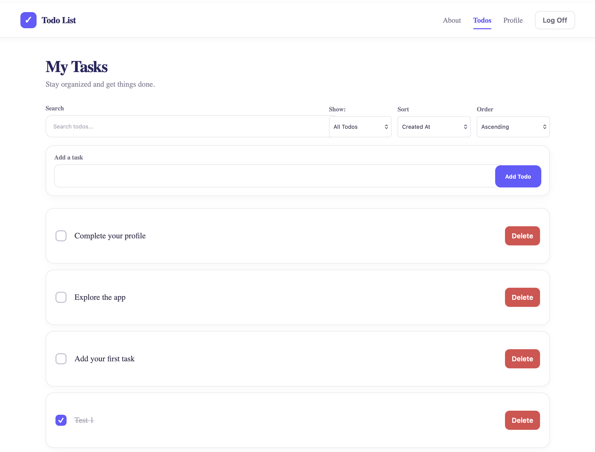
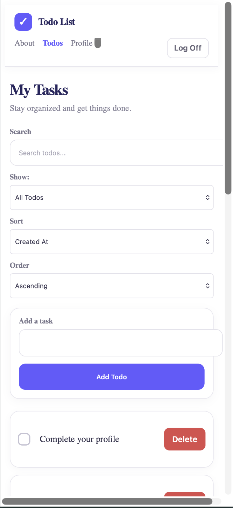

# Brian Rebimbas

# Todo List App

A responsive Todo List application built with React that allows users to create, edit, complete, delete, sort, and filter todo items. The application uses React state management, routing, authentication, form validation, and client-side security practices to provide a clean and user-friendly experience.

## Live Demo

Application is not yet deployed. Future location to store link.

## Features

- Add new todo items
- Edit existing todo items
- Mark todos as completed
- Delete todo items
- Filter todos by title
- Sort todos by available sorting options
- Debounced filtering for improved performance
- User authentication and logoff functionality
- Client-side validation for user-entered text
- Required-field validation
- Input maximum-length restrictions
- Whitespace sanitization before saving todo titles
- User-friendly validation error messages
- Responsive design for desktop and mobile devices
- Visual indication of completed todos
- Protected todo functionality for authenticated users

## Technologies Used

- React
- React Router
- JavaScript (ES6+)
- HTML5
- CSS3
- Vite
- Fetch API
- Git
- GitHub
- npm

## Screenshots

### Desktop View



### Mobile View



> Add your screenshots to a `screenshots` folder in the project root and name them `desktop.png` and `mobile.png`.

## Getting Started

### Prerequisites

Before running the application, make sure you have the following installed:

- Node.js
- npm
- Git

You can verify your Node.js and npm installations with:

```bash
node --version
npm --version
```

### Installation

1. Clone the repository:

```bash
git clone YOUR_GITHUB_REPOSITORY_URL
```

2. Navigate into the project directory:

```bash
cd YOUR_PROJECT_FOLDER
```

3. Install the project dependencies:

```bash
npm install
```

4. Start the development server:

```bash
npm run dev
```

5. Open the local development URL provided by Vite in your browser.

## Available Scripts

### `npm run dev`

Starts the Vite development server and runs the application in development mode.

```bash
npm run dev
```

### `npm run build`

Creates an optimized production build of the application.

```bash
npm run build
```

### `npm run preview`

Runs the production build locally so the production build can be tested before deployment.

```bash
npm run preview
```

### `npm run lint`

Runs ESLint to identify potential JavaScript and code-quality issues.

```bash
npm run lint
```

> The exact scripts available may vary depending on the project's `package.json`.

## Design Decisions

The application uses a clean, modern CSS-based design to keep the interface simple and easy to use.

Purple is used as the primary visual theme throughout the application. Completed todos are visually distinguished with a strikethrough and completion indicator so users can quickly identify tasks that have been finished.

The application uses responsive CSS to provide a consistent experience across desktop and mobile screen sizes.

The interface also uses familiar controls and visual feedback for common actions such as editing, completing, canceling, and deleting todos.

## Security and Validation

The application includes client-side validation practices for user-submitted todo titles.

These practices include:

- Validating required text fields before submission
- Trimming unnecessary whitespace from todo titles
- Limiting todo titles to a maximum of 100 characters
- Preventing invalid todo titles from being submitted
- Displaying user-friendly validation messages
- Avoiding the display of system or technical error details to users

Client-side validation improves the user experience, while server-side validation should still be used by the backend as the authoritative security boundary.

## Future Improvements

With additional development time, the application could be expanded with:

- Todo due dates
- Todo categories or tags
- Todo priority levels
- Additional filtering options
- Drag-and-drop todo organization
- Dark mode/Light mode toggle
